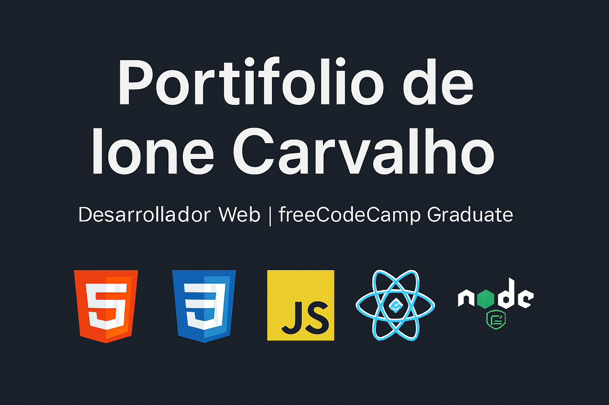

# Portifolio - Ione Carvalho

Bienvenido a mi portifolio profesional como desarrollador web.  
Aquí muestro mis proyectos, certificaciones y habilidades adquiridas en el camino del aprendizaje y la práctica.

---

## 🚀 Proyectos destacados
Cada proyecto incluye una breve descripción y un enlace a su demo en GitHub Pages:

- **Conversor de Número**  
  Herramienta en JavaScript para convertir números.  
  👉 [Ver demo](https://ionecarvalho.github.io/conversor-numero/)

- **Formulario de Preferencia de Colores**  
  Formulario interactivo en HTML, CSS y JS.  
  👉 [Ver demo](https://ionecarvalho.github.io/formulario-colores/)

- **Documentación Técnica (freeCodeCamp)**  
  Proyecto de documentación técnica en español.  
  👉 [Ver demo](https://ionecarvalho.github.io/documentacion-tecnica/)

- **Creature Search**  
  Buscador de criaturas con estadísticas dinámicas.  
  👉 [Ver demo](https://ionecarvalho.github.io/creature-search/)

- **CelloStudio**  
  Sitio web musical para violonchelos.  
  👉 [Ver demo](https://ionecarvalho.github.io/cellostudio/)

- **Tributo a Janis Joplin**  
  Página homenaje con biografía y estilo retro.  
  👉 [Ver demo](https://ionecarvalho.github.io/janis-joplin/)

- **Comprobador de Palíndromos**  
  Aplicación en JavaScript para verificar palíndromos.  
  👉 [Ver demo](https://ionecarvalho.github.io/palindromo/)

- **Validador de Número Telefónico**  
  Aplicación en JavaScript para validar números telefónicos.  
  👉 [Ver demo](https://ionecarvalho.github.io/validador-telefono/)

---

## 🛠️ Skills
- 💻 HTML5  
- 🎨 CSS3  
- ⚡ JavaScript (ES6+)  
- ⚛️ React  
- 🌐 Node.js  

---

## 🎓 Certificaciones
- [🏅 freeCodeCamp - JavaScript Algorithms and Data Structures v8](https://www.freecodecamp.org/certification/ionecarvalho/javascript-algorithms-and-data-structures-v8)  
- 🎓 freeCodeCamp Graduate

---

## 📬 Contacto
- Email: [ione.futuro@gmail.com](mailto:ione.futuro@gmail.com)  
- GitHub: [ionecarvalho](https://github.com/ionecarvalho)

---

## 🌍 Publicación
Este portifolio está disponible en **GitHub Pages**:  
👉 [https://ionefuturo-ioio.github.io/Portifolio/](https://ionefuturo-ioio.github.io/Portifolio/)

